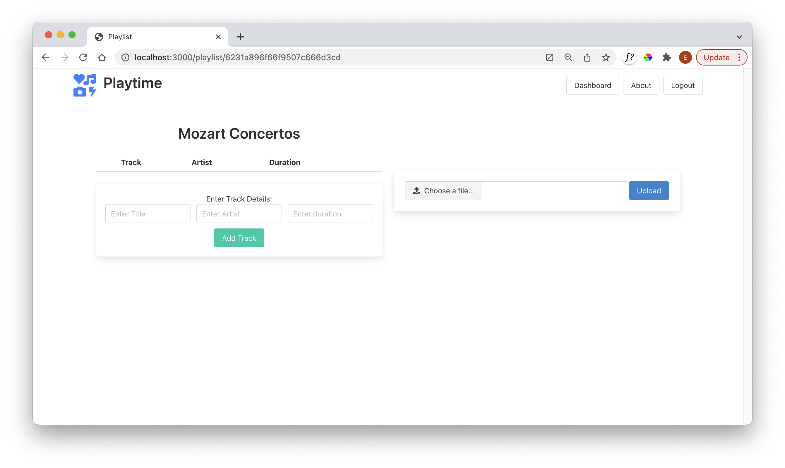
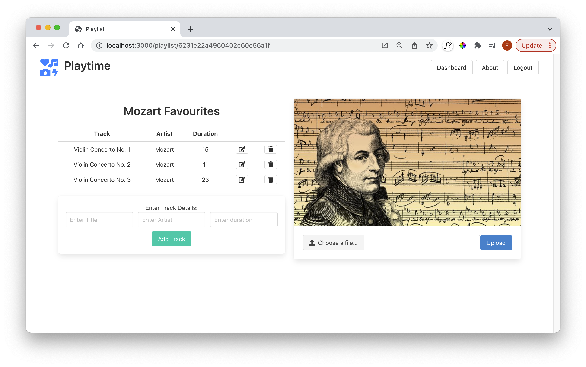
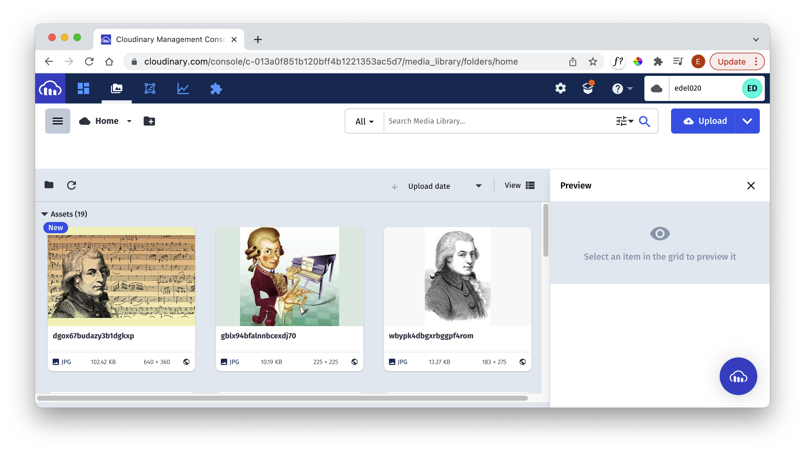
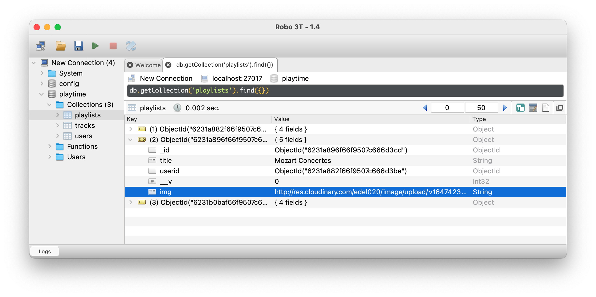

# Upload Image UX

We would like to associate an image with each playlist. This image will be stored in the Cloudinary service, but we will retain a link to the image in each playlist object in our data store.

Starting with the playlist view, a new panel to permit an images to be uploaded:

Choosing and uploading a file, it should render to the page like this:

The image should be visible in our Cloudinary dashboard:

We will extend the datastore (in a later step) to store the image link as an **img** string:

